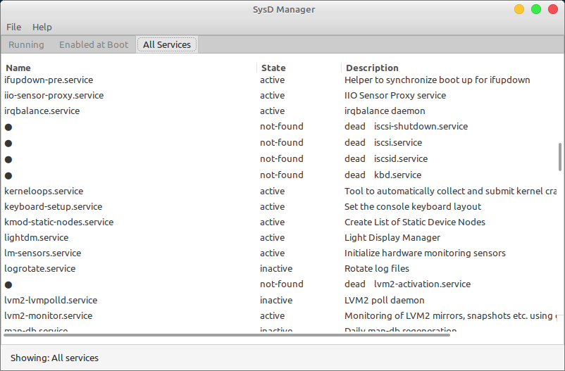
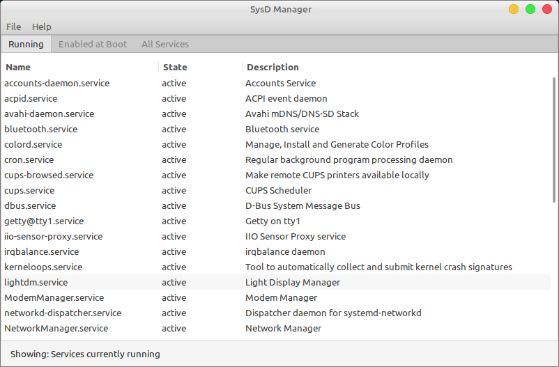

### Systemd Services Manager ###
GUI tool to manage systemd services

#### Dependencies
Requires only GTK and libsystemd runtime libraries.

#### Execution
- Compiled binary (fast, native).
- Run `sysd-mgr` from terminal

#### Compilation
- Compile with gcc sysd-mgr.c -o sysd-mgr `pkg-config --cflags --libs gtk+-3.0`
- Run `./sysd-mgr` from terminal

### Usage & Screenshots

